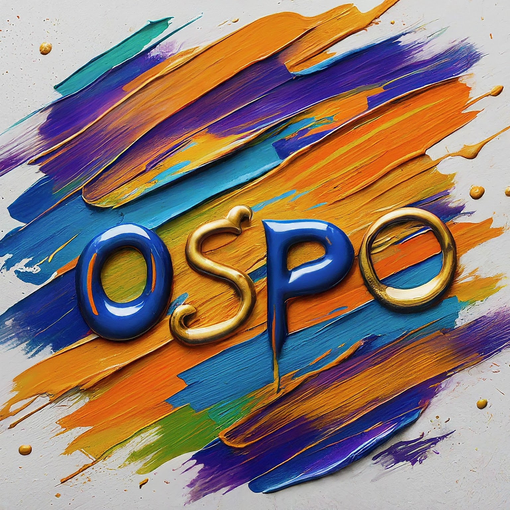

# George Washington University Open Source Program Office (OSPO)

## Overview
Our team is committed to fostering a culture of networked collaboration, promoting open-source software development, open data, and open access in research and education.  We will support the university community in adoption of open practices to ensure we maximize our impact on a local and global scale to leverage GWU’s research, teaching, and policy expertise.

Core objectives:
 - Create a centralized organizational entity advocating for open practices initiatives.
 - Develop and implement policies, processes, and guidelines for open-source software and open scholarship
 - Provide training, tools, and resources to support open-source software (OSS), open data, and open access.
 - Build a strong local community comprised of faculty, staff, and students.

## Why should you consider joining the open source community?
 - Connect with a global community of engineers and scientists passionate about sharing knowledge and solving important challenges.
 - Learn how to deliver high quality and reproducible research
 - Learn skills to develop code in a collaborative development environment that will translate well to careers in industry.
 - Learn skills to build and deploy production code
 - Support and improve a tool you love
 - Public OSS will always be available to you after you leave a project or a company
 - OSS is more secure than proprietary software
 - OSS enables innovation better than closed development

 To learn more about how the OSPO can support your open source work or if you are excited to join the GW open source community, please contact us by email at ospo@gwu.edu.

 
 GW's Open Source Programs Office is generously supported by the Alfred P. Sloan Foundation.