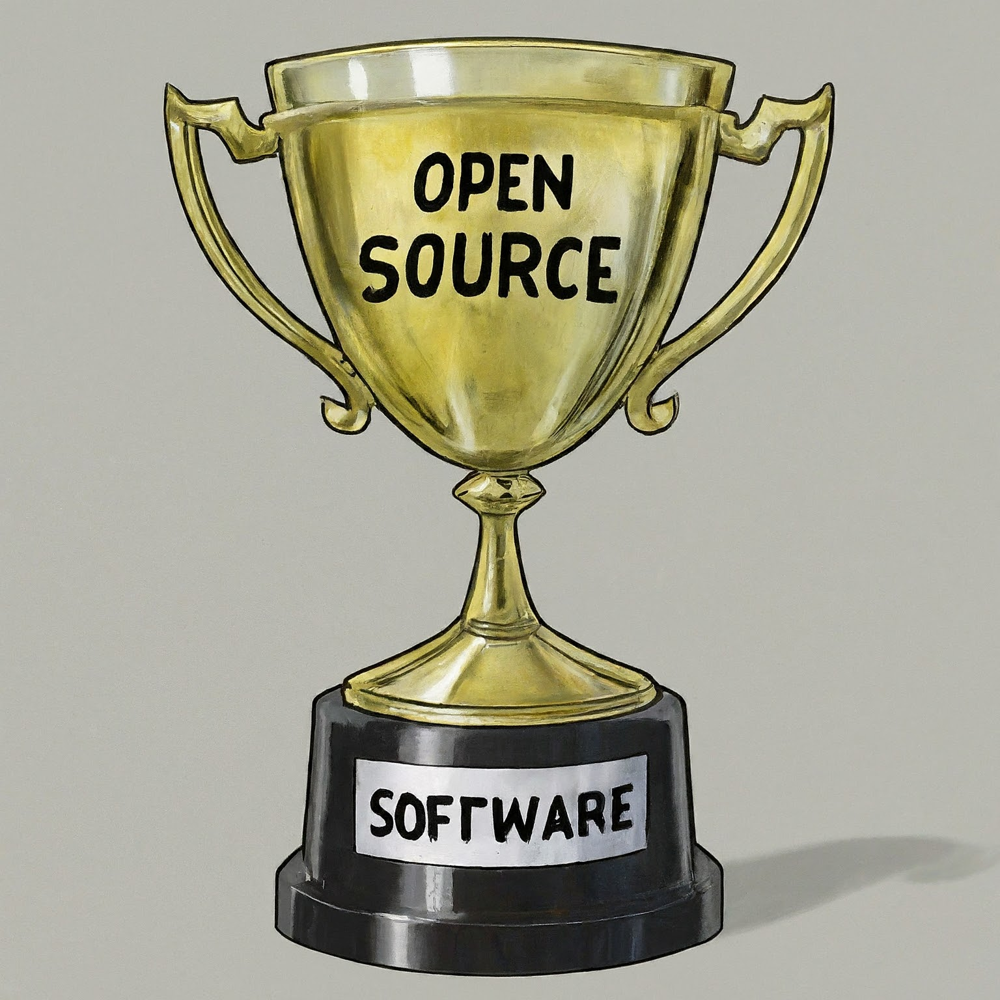

# OSPO Open Source Software Prizes

The GW University OSPO is awarding a minimun of $2000 in prizes annually for two contests beginning in 2024.  The goal of this award program is to encourage students to create and engage with open source software communities and learn skills to develop software collaboratively.  The students’ efforts will improve research reproducibility as well as helping students prepare for careers in research and industry.
1. [Group Collaboration Awards](#1-group-collaboration-awards) - separate tracks for undergraduates and graduate students each with 1st and 2nd place awards.
2. [Individual Contributor Awards](#2-individual-contributor-awards) - four $100 awards for at least one meaningful contribution to a public open source project.

-------------------

## 1. Group Collaboration Awards
Competition for creating Open Source Software (OSS) projects and learning to develop software collaboratively.

### Prizes
|  Tracks  | Undergraduates | Graduate Students |
| --- | ----------- | ----------- |
| 1st Prize | $500 | $500 |
| 2nd Prize | $250 | $250 |

### Application Guidance
Entries will be reviewed by a committee composed of GW faculty and staff.  To apply, complete the application form and email it to ospo@gwu.edu

[Download the OSPO Group Collaboration Application Form](OSPO_Group_Collaboration_Application_Form.pdf)

### Award Criteria
Criteria - judging based on 4 categories evaluated with equal weight
 - 25% - Reproducibility
 - 25% - Impact - Meaningful and interesting project 
 - 25% - Adherence to open-source and software development best practices
 - 25% - Collaboration - inclusivity, cross discipline, demonstrative community building

## 2. Individual Contributor Awards
Lottery encouraging individual contributions to OSS projects

### Prizes
Five $100 awards drawn at random from all entrants that submit an application form successfully demonstrating at least one meaningful contribution to a public open source project.

### Application Guidance
Entries will be reviewed by a committee composed of GW faculty and staff.  To apply, complete the application form and email it to ospo@gwu.edu

[Download the OSPO Individual Contributor Application Form](OSPO_Individual_Contributor_Application_Form.pdf)

### Award Criteria
Complete applications will be evaluated and must meet a minimum threshold to be 
entered in the lottery:
 - Must include at least one meaningful contribution of code or documentation 
addressing existing issues and accepted by the maintainer of an existing 
active Project
 - The project you contribute to may be a GW or external project, but our evaluation
committee will verify that the contributions are beneficial and not trivial

Please take care to understand that project maintainers can be extremely busy, so to be
a good open source contributor, follow the codes of conduct and contribution guidelines
and be sure to tackle only existing issues.  E.G. Do not submit a pull request to fix typos.